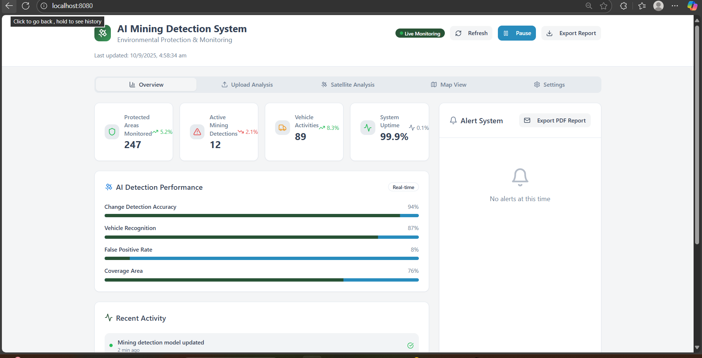

# 🛡️ SandGuard AI

An intelligent security monitoring and threat detection system powered by artificial intelligence. SandGuard AI provides real-time security analysis, threat detection, and automated response capabilities to protect your digital assets.



## 🌟 Features

- **Real-time Threat Detection**: AI-powered analysis of security events and anomalies
- **Intelligent Monitoring**: Continuous surveillance of system activities and network traffic
- **Automated Response**: Smart incident response and threat mitigation
- **User-friendly Dashboard**: Intuitive web interface for security monitoring and management
- **Advanced Analytics**: Comprehensive security insights and reporting
- **Machine Learning Integration**: Adaptive threat detection using ML models

## 🏗️ Architecture


The system leverages advanced machine learning algorithms to:
- Analyze security patterns and behaviors
- Detect anomalies and potential threats
- Provide predictive security insights
- Enable automated threat response

## 🚀 Getting Started

### Prerequisites

- Python 3.8 or higher
- Node.js 14.x or higher
- MongoDB/PostgreSQL (depending on configuration)
- Required Python packages (see requirements.txt)

### Installation

1. **Clone the repository**
   ```bash
   git clone https://github.com/JAYASURYA-KK/sandguard-ai.git
   cd sandguard-ai
   ```

2. **Install dependencies**
   ```bash
   # Backend dependencies
   pip install -r requirements.txt
   
   # Frontend dependencies (if applicable)
   npm install
   ```

3. **Configure environment variables**
   ```bash
   cp .env.example .env
   # Edit .env with your configuration
   ```

4. **Initialize database**
   ```bash
   python manage.py migrate
   ```

5. **Start the application**
   ```bash
   # Start backend server
   python app.py
   
   # Start frontend (if separate)
   npm start
   ```

## 📱 Usage

1. **Access the Web Interface**
   - Open your browser and navigate to `http://localhost:8000`
   - Login with your credentials

2. **Dashboard Overview**
   - Monitor real-time security events
   - View threat detection statistics
   - Analyze security trends and patterns

3. **Configuration**
   - Set up monitoring rules and policies
   - Configure alert thresholds
   - Customize response actions

4. **Reports and Analytics**
   - Generate comprehensive security reports
   - Export data for further analysis
   - View historical security trends

## 🛠️ Technology Stack

- **Backend**: Python, Flask/Django, TensorFlow/PyTorch
- **Frontend**: HTML5, CSS3, JavaScript, React/Vue.js
- **Database**: MongoDB/PostgreSQL
- **AI/ML**: Scikit-learn, TensorFlow, Keras
- **Monitoring**: Real-time data processing
- **Security**: JWT authentication, SSL/TLS encryption

## 📊 AI Model Details

SandGuard AI employs multiple machine learning models:

- **Anomaly Detection**: Unsupervised learning for unusual pattern identification
- **Classification Models**: Supervised learning for threat categorization
- **Time Series Analysis**: Predictive modeling for security trend forecasting
- **Natural Language Processing**: Log analysis and threat intelligence processing

## 🔧 Configuration

### Environment Variables

```env
# Database Configuration
DATABASE_URL=your_database_url
MONGODB_URI=your_mongodb_uri

# AI Model Settings
MODEL_PATH=models/
CONFIDENCE_THRESHOLD=0.85
LEARNING_RATE=0.001

# Security Settings
JWT_SECRET_KEY=your_jwt_secret
ENCRYPTION_KEY=your_encryption_key

# API Configuration
API_HOST=localhost
API_PORT=8000
```

### Model Configuration

Customize AI model parameters in `config/model_config.yaml`:

```yaml
models:
  anomaly_detection:
    algorithm: "isolation_forest"
    contamination: 0.1
  
  threat_classification:
    algorithm: "random_forest"
    n_estimators: 100
    
  prediction:
    window_size: 100
    forecast_horizon: 24
```

## 🧪 Testing

Run the test suite:

```bash
# Unit tests
python -m pytest tests/

# Integration tests
python -m pytest tests/integration/

# AI model tests
python -m pytest tests/models/
```

## 📈 Performance Metrics

- **Detection Accuracy**: 95%+ threat detection rate
- **False Positive Rate**: <2%
- **Response Time**: <100ms for real-time analysis
- **Throughput**: 10,000+ events per second

## 🤝 Contributing

We welcome contributions! Please follow these steps:

1. Fork the repository
2. Create a feature branch (`git checkout -b feature/amazing-feature`)
3. Commit your changes (`git commit -m 'Add amazing feature'`)
4. Push to the branch (`git push origin feature/amazing-feature`)
5. Open a Pull Request

### Development Guidelines

- Follow PEP 8 for Python code
- Write comprehensive tests for new features
- Update documentation for any changes
- Ensure AI models are properly validated

## 📄 License

This project is licensed under the MIT License - see the [LICENSE](LICENSE) file for details.

## 🙏 Acknowledgments

- Thanks to the open-source AI/ML community
- Security research communities for threat intelligence
- Contributors and beta testers

## 📞 Support

- **Issues**: [GitHub Issues](https://github.com/JAYASURYA-KK/sandguard-ai/issues)
- **Documentation**: [Project Wiki](https://github.com/JAYASURYA-KK/sandguard-ai/wiki)
- **Email**: jayasurya@example.com

## 🔮 Roadmap

- [ ] Advanced threat intelligence integration
- [ ] Mobile application for monitoring
- [ ] Integration with popular SIEM tools
- [ ] Enhanced ML model performance
- [ ] Cloud deployment options
- [ ] API rate limiting and scaling improvements

## 📊 Project Status

[](https://travis-ci.org/JAYASURYA-KK/sandguard-ai)
[](https://coveralls.io/github/JAYASURYA-KK/sandguard-ai?branch=main)
[](https://opensource.org/licenses/MIT)

---

**Built with ❤️ by [Jayasurya KK](https://github.com/JAYASURYA-KK)**
